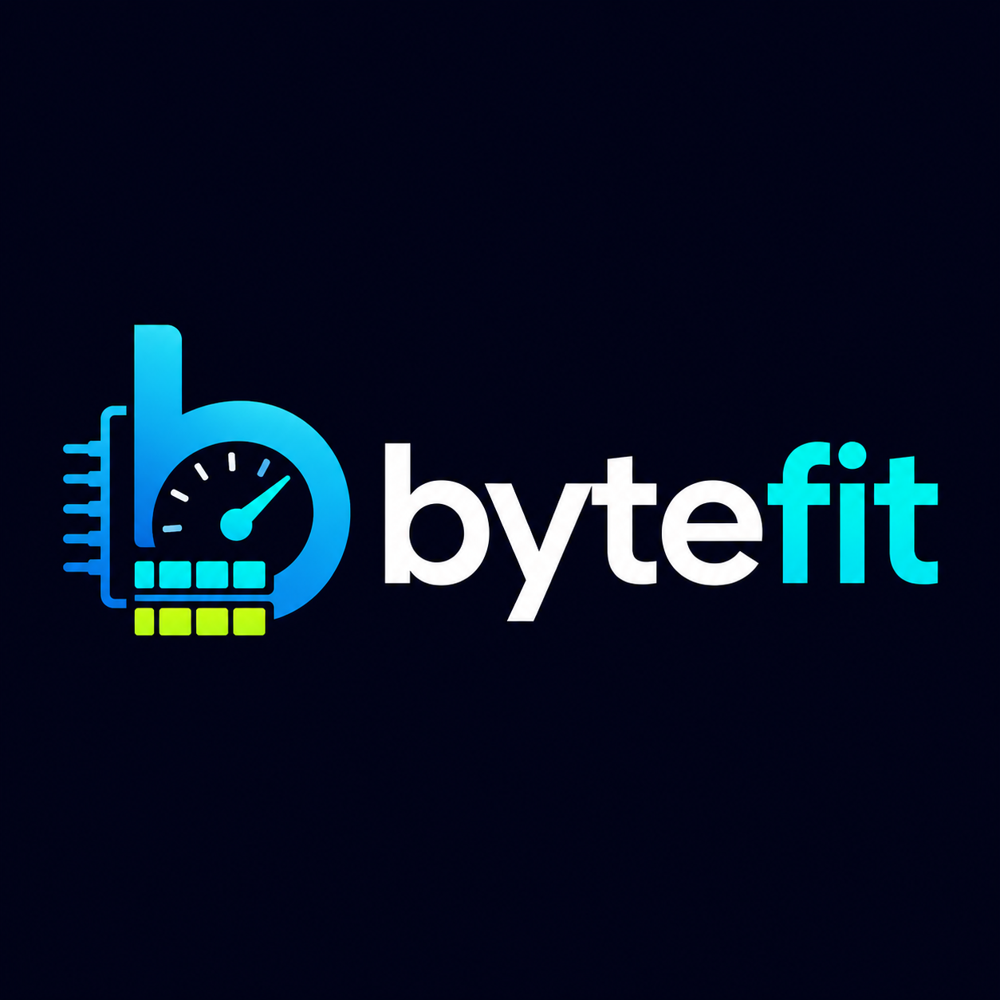

<p align="center">
  
</p>

<p align="center">
  <a href="https://github.com/mcp-tool-shop-org/bytefit/actions/workflows/ci.yml"></a>
  <a href="LICENSE"></a>
</p>

**Hardware-aware local-LLM loadout planner.** It tells you the largest, most capable model your
machine can actually run well — with the exact quantization, KV-cache, context length, and offload
policy — and refuses configurations that would silently page to disk.

bytefit is an **advisor**, not just an estimator. Jan and LM Studio tell you whether a model *fits*;
bytefit tells you what to *run* — model class + quant + KV-cache type + context + offload policy —
and **refuses** any configuration that would tip into uncontrolled paging (which collapses decode
throughput by roughly 78×).

```
decode tok/s  ≈  memory_bandwidth ÷ bytes-read-per-token
```

Decode is memory-bandwidth-bound. bytefit minimizes bytes-read-per-token, keeps them on the fastest
tier that fits, predicts the result, and refuses configs that would page.

## Quick start

```bash
npm install -g @mcptoolshop/bytefit

bytefit probe                # what hardware you have
bytefit recommend            # rank your installed Ollama models, best-first
bytefit plan qwen3.6:27b     # a full loadout + ready-to-run llama.cpp / Ollama args
```

```
$ bytefit recommend
NVIDIA GeForce RTX 5090 / 31.8 GiB VRAM / 63.4 GiB RAM — 10 models, 10 runnable:

  qwen3.6:35b-a3b     FITS      Q4_K_M q8_0 ctx8192  ~132 tok/s  [vram]
  mistral-small:24b   FITS      Q4_K_M q8_0 ctx8192  ~84 tok/s  [vram]
  qwen3.6:27b         FITS      Q4_K_M q8_0 ctx8192  ~74 tok/s  [vram]
  gemma4:31b          FITS      Q4_K_M q8_0 ctx8192  ~60 tok/s  [vram]
  ...
```

## What it does

- **Probe** — VRAM, RAM, and *measured* NVMe bandwidth across NVIDIA, AMD, and Apple Silicon.
- **Choose** — model class, quant family, KV-cache type, context length, and offload policy for your hardware.
- **Refuse** — configurations that would silently page to disk, with a structured reason and a non-zero exit code.
- **Emit** — ready-to-run llama.cpp / Ollama / LM Studio arguments and a predicted tok/s.

It ranks your installed **Ollama** models out of the box, scans a folder of `.gguf` files (`--dir`),
or ranks a **Hugging Face** GGUF repo without downloading it (`--hf <repo>`).

## Why

Fit labels and memory estimates are table stakes. No existing tool closes the *decision* loop:
hardware-fingerprinted quant + KV-type recommendation, context sizing tied to quant-adjusted
headroom, a model-class recommendation, and a hard anti-paging refusal. That combination is bytefit.
The architecture and the evidence behind every heuristic are in [SPEC.md](SPEC.md) and
[docs/research-grounding.md](docs/research-grounding.md).

## Requirements

Node ≥ 20. Optional: [Ollama](https://ollama.com) for the installed-model catalog, and
llama.cpp / LM Studio to run the emitted commands. Tested live on an RTX 5090.

## Security

No telemetry. By default no external network — the catalog uses the local Ollama loopback API; the
optional `--hf` flag fetches public GGUF headers from huggingface.co (off by default, read-only,
weights never downloaded). Reads local model files and system info, and shells out to trusted system
binaries (`nvidia-smi`). Untrusted GGUF headers are bounds-checked. See [SECURITY.md](SECURITY.md).

## Ship Gate

<!-- SCORECARD:START -->
Hard gates **A–D pass**. Overall **78%** (18/23) — the open items are the release-phase identity
polish (logo, translations, landing page, repo metadata) and the version tag created at release. See
[SHIP_GATE.md](SHIP_GATE.md), or run `npx @mcptoolshop/shipcheck audit` to verify.
<!-- SCORECARD:END -->

---

MIT © [MCP Tool Shop](https://mcp-tool-shop.github.io/) · [SPEC](SPEC.md) · [CHANGELOG](CHANGELOG.md)
